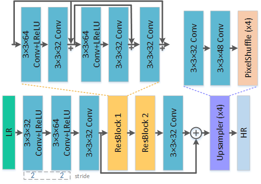
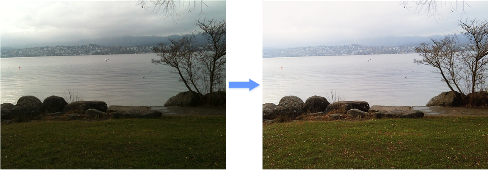
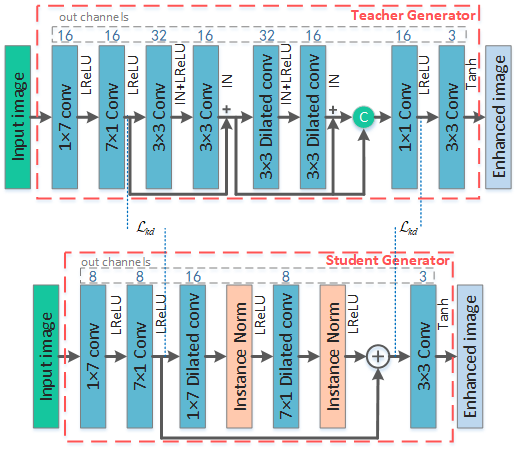
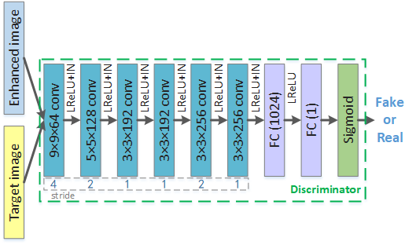

# PPCN (Team: Rainbow)
[[Paper]](files/PPCN.pdf)
## Super-Resolution Task
<p align="center">
   <br />
  <em> The schematics of the proposed network for image super-resolution</em>
</p>

### Testing

First, download the [SR_Test_Datasets](https://drive.google.com/open?id=1_K6mchwDGOQMIXuBIGrlDA4EAYgbtdmU) and put them in ``test/SR_test_data`` folder.

Run the following command to super-resolve low-resolution images

```
python evaluate_super_resolution.py
```
## Enhancement Task
<p align="center">
   <br />
  <em> DPED image enhanced by our method </em>
</p>
<p align="center">
  
   <br />
  <em> The structure of the proposed generator and discriminator for image enhancement </em>
</p>

### Testing

Run the following command to enhance low-quality images
```
python evaluate_enhancement.py
```

## Code References
[1]https://github.com/aiff22/ai-challenge

[2]https://github.com/aiff22/DPED

[3]https://github.com/roimehrez/contextualLoss
